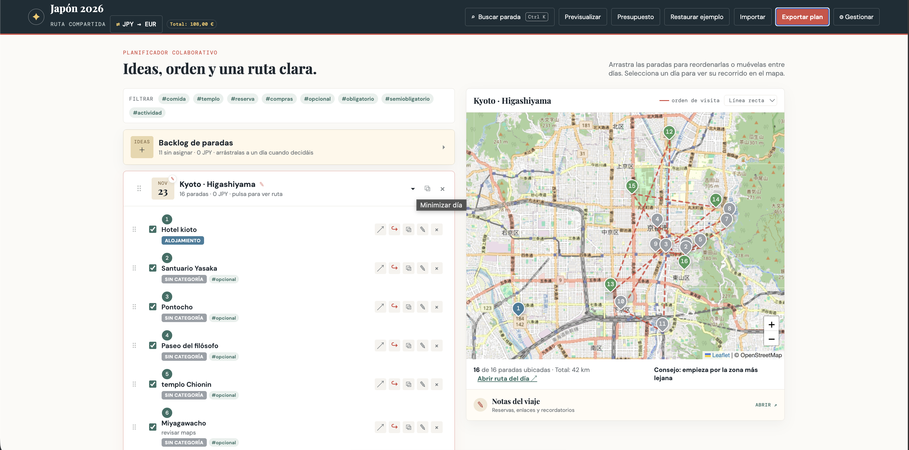

# Trip Planner

> A lightweight, map-based itinerary planner for turning a list of ideas into a clear day-by-day route.

Trip Planner is a responsive, browser-based travel organizer built with vanilla JavaScript. Add places to a backlog, arrange them into days with drag and drop, and visualize each day's route on an interactive map. Plans are saved locally and can be exported as JSON to back them up or share them with another traveler.

The interface is currently available in Spanish.



## Features

- **Day-by-day itineraries** — create, rename, reorder, duplicate, collapse, and delete travel days.
- **Flexible backlog** — collect ideas before deciding where they belong.
- **Custom drag and drop** — reorder stops or move them between days on desktop and touch devices.
- **Interactive maps** — display numbered stops and switch between straight lines and street-based routes.
- **Travel profiles** — calculate routes for walking, cycling, or driving.
- **Place search** — find addresses through OpenStreetMap and preview their location before saving.
- **Stop details** — keep notes, tags, categories, opening hours, costs, and map visibility preferences for every place.
- **Schedule overview** — compare opening-hour ranges and spot possible overlaps within a day.
- **Tags and categories** — organize stops, filter the itinerary, customize colors, and control which categories connect to the route.
- **Quick search** — jump to any saved stop with `Ctrl/Cmd + K`.
- **Trip budget** — track costs by day and see totals in both local and foreign currencies.
- **Currency conversion** — retrieve current exchange rates for a selection of common currencies.
- **Trip notes** — save general information using lightweight Markdown formatting.
- **Preview mode** — switch to a cleaner, read-only presentation of the itinerary.
- **Import and export** — save the complete plan as JSON and restore it later.
- **Multi-trip library** — create, switch, rename, duplicate, archive, restore, and delete independent trips stored in IndexedDB.
- **Optional cloud workspaces** — always-visible account controls, email/password accounts, durable local-first synchronization, explicit conflict resolution, and revision history with graceful local fallback when the API is unavailable.
- **GitHub JSON sync** — import an existing repository file and explicitly publish updates with conflict protection.
- **LLM trip assistant** — connect LM Studio, OpenAI-compatible, or Anthropic endpoints to discuss the current plan and review natural-language changes before applying them.
- **Local persistence** — changes are committed to IndexedDB first; the legacy `localStorage` copy remains available during migration and rollback.
- **Responsive design** — designed for both desktop and mobile use.

## Getting Started

There is no frontend build step or package installation. You only need a modern browser and a small local web server. The optional cloud API has its own isolated Node dependencies; see [`server/README.md`](server/README.md).

To run the complete stack (frontend, API, and PostgreSQL) with Docker:

```bash
docker compose up --build
```

Then open [http://localhost:8000](http://localhost:8000). The API applies pending database migrations automatically before it starts accepting requests. The frontend proxies `/api/*` to the API inside the Compose network, so the browser only accesses one origin. PostgreSQL is exposed only on `127.0.0.1:5432` by default, and its data persists in the `trip_planner_postgres_data` volume. Configure `APP_ORIGIN`, `FRONTEND_PORT`, and the `POSTGRES_*` variables in a root `.env` file when deploying under a different URL or with non-development credentials. Set `NODE_ENV=production` when the public origin uses HTTPS so session cookies are marked as secure.

To run only the static frontend without Docker:

```bash
git clone <your-repository-url>
cd trip-planner
python3 -m http.server 8000
```

Then open [http://localhost:8000](http://localhost:8000) in your browser.

> Opening `index.html` directly with a `file://` URL is not supported because the application uses native ES modules.

## How to Use

1. Change the trip name at the top of the page.
2. Add places to the backlog or directly to a travel day.
3. Select an address suggestion to attach coordinates to a stop.
4. Drag stops into the order in which you want to visit them.
5. Select a day to display its route on the map.
6. Add categories, tags, schedules, notes, and costs as needed.
7. Export the plan as JSON when you want a backup or wish to share it.

### GitHub JSON synchronization

Open **GitHub** in the top navigation to access the compact action menu. **Configurar GitHub** stores the owner, repository, branch or ref, path of an existing plan JSON file, and optional session token without importing anything. Owner, repository, branch, and JSON path offer GitHub-backed autocomplete suggestions as their required parent fields become available. **Conectar a GitHub** verifies access to that file; **Pull y sincronizar** imports it after confirmation; and **Publicar cambios** updates it explicitly. Public files can be read without authentication, and GitHub never replaces the local plan until you accept the pull confirmation.

Private reads and publishing use a [fine-grained personal access token](https://github.com/settings/personal-access-tokens). Limit the token to the selected repository and grant only **Contents: read** for private reads or **Contents: read and write** for publishing. The token is kept in `sessionStorage` for the current browser session; it is not included in the saved trip, exported JSON, connection metadata, URLs, or commit messages. Because this is a browser-only integration, scripts running on the same origin can access the session credential; close the session when you are finished.

Publishing updates only the connected existing file and is always explicit. It is disabled when the local plan differs from the verified remote file only by `exportedAt`, or when there are no differences at all. A custom commit message can be entered before publishing; leaving it empty uses `Actualizar plan de viaje`. The planner sends the SHA from the last verified read, so GitHub rejects the write if the remote file changed. In that case, export the local plan as a backup, then use **Pull y sincronizar** to inspect/import the remote version or reconcile the changes outside the planner. The integration does not create repositories, branches, files, pull requests, merge changes, poll GitHub, or force an overwrite. Local import/export remains available when GitHub is unavailable.

The app starts with a sample itinerary, which can be restored at any time from the top navigation.

### LLM trip assistant

Open the floating **Asistente** button and use **⚙** to select LM Studio, an OpenAI-compatible API, or Anthropic. Configure the API base URL and model; LM Studio defaults to `http://127.0.0.1:1234/v1` and can detect the first loaded model. The configured provider receives the current portable planning document with each request, including the real day and stop IDs needed to propose safe changes.

The model can answer questions or propose edits to days, stops, trip notes, route settings, and tags. Responses are rendered progressively from each provider's SSE stream. Proposed mutations are validated only after the complete response arrives and appear as an explicit review card; nothing changes until **Aplicar cambios** is pressed. A proposal expires if the plan has changed since it was generated. **↺ Nueva conversación** clears the transient conversation and pending proposals without changing the trip or provider settings.

Provider, base URL, and model are stored locally. API keys remain only in `sessionStorage` and are never included in plan JSON exports. Browser requests require the endpoint to allow the planner origin through CORS. For cloud providers, prefer a trusted server-side proxy so long-lived API credentials are not exposed to browser code.

## Project Structure

```text
trip-planner/
├── index.html               # Application shell and dialogs
├── js/
│   ├── app/main.js          # The single JavaScript entry point
│   ├── core/                # State, constants, and portable plan data
│   ├── shared/              # Domain-neutral DOM and UI primitives
│   └── features/            # Product capabilities grouped by domain
│       ├── planner/         # Itinerary UI, dialogs, actions, and drag/drop
│       ├── map/             # Maps, routing, basemaps, and place images
│       ├── finance/         # Currency conversion and trip budget
│       ├── notes/           # Trip notes
│       ├── companion/       # On-trip view and timeline
│       ├── github/          # Optional JSON synchronization
│       ├── assistant/       # LLM chat and reviewed plan proposals
│       ├── library/         # IndexedDB-backed multi-trip library
│       ├── cloud/           # Optional account, sync, conflicts, and history
│       └── workspace/       # Desktop workspace resizing
├── server/                  # Optional Node/Postgres API and migrations
└── styles/
    ├── app.css              # The single stylesheet entry point
    ├── foundation/          # Tokens and global defaults
    ├── features/            # Styles owned by product capabilities
    └── layout/              # Workspace and responsive overrides
```

The frontend uses native ES modules and intentionally has no framework, bundler, package manager, or build pipeline. The optional server is isolated under `server/` and uses its own `package.json`.
Pure domain logic is covered with the built-in Node.js test runner; run it with `node --test`.

### Architectural boundaries

- `app` composes and starts the application; feature modules do not import it.
- `core` owns shared data and persistence. It must not depend on browser UI helpers.
- `shared` contains small domain-neutral browser primitives.
- `features` may depend on `core`, `shared`, and explicit exports from other features. New product behavior should live with the feature that owns it instead of returning to a flat `js/` directory.
- `styles/app.css` defines cascade order. New feature styles belong under `styles/features/` and must be imported there explicitly.

## External Services

Some functionality requires an internet connection:

- [Leaflet](https://leafletjs.com/) for interactive maps
- [OpenStreetMap](https://www.openstreetmap.org/) for map tiles
- [Nominatim](https://nominatim.org/) for place search and geocoding
- [OSRM](https://project-osrm.org/) public routing servers for street-based routes
- [Frankfurter](https://frankfurter.dev/) for exchange rates
- [Wikipedia](https://www.wikipedia.org/) for place thumbnails
- [Google Fonts](https://fonts.google.com/) for typography

These are public third-party services. Their availability, usage policies, and rate limits are outside this project's control. Straight-line route visualization and previously saved itinerary data remain available when routing or geocoding services cannot be reached.

## Optional accounts and cloud synchronization

The account and cloud controls are always visible. The browser checks the API at startup and reports when it is unavailable while keeping every local workflow operational. **Cuenta** lets a person register or sign in with email and password when the API is available; creating an account is never required for local editing. The icon-only global save action (also available with `Ctrl+S`/`Cmd+S`) publishes pending changes manually. Once per minute the browser checks for pending changes and only then saves automatically, notifying the user after a successful automatic save. Every edit still commits locally before entering the durable outbox, so downloaded trips remain available offline.

If two devices edit the same remote revision, automatic publication stops. The conflict dialog can adopt the cloud version after creating a recoverable local copy, publish the local version explicitly, or keep both as independent trips. Revision previews are read-only; restoring creates a new revision and participates in the current session's Undo history.

The remote service, environment variables, Postgres setup, mail transport, security policy, integration tests, and rollback procedure are documented in [`server/README.md`](server/README.md).

## Data and Privacy

Trips are stored in the browser's IndexedDB. During the migration window, the previous `trip-planner`/`japan-planner` `localStorage` value is intentionally retained as a recovery copy. Device preferences, filters, active selection, Undo history, ownership, sessions, remote revisions, and the synchronization queue are excluded from portable JSON exports.

When the optional cloud deployment is enabled and a user explicitly uploads a trip, its portable document and revision metadata are stored in Postgres. Passwords are stored as salted `scrypt` derivations and session secrets stay in an `HttpOnly` cookie. The service retains at least the 100 most recent revisions for an existing trip. Closing a session keeps locally downloaded copies according to the notice shown in the app; pending edits can be converted into local copies first. Account deletion requires the current password and removes remote account data after revoking sessions.

Place searches, routes, exchange-rate requests, map tiles, and image lookups are sent directly from the browser to their respective third-party services.

Clearing site data removes IndexedDB and local recovery copies, so export important itineraries as JSON before clearing browser storage. If a local write fails, the status bar does not claim the trip is saved and offers immediate export.

## Browser Support

Trip Planner targets current versions of Chrome, Edge, Firefox, and Safari. It relies on modern browser features such as ES modules, `dialog`, `structuredClone`, pointer events, and `localStorage`.

## Development

Edit the HTML, CSS, or JavaScript files and refresh the browser. Run `node --test` for the pure-logic suite, then check UI changes manually by serving the project and exercising the relevant desktop and mobile flows.

Contributions are welcome. When changing the UI, keep user-facing copy in Spanish, escape user-provided values before inserting them into HTML, and preserve the central render cycle used throughout the application.
