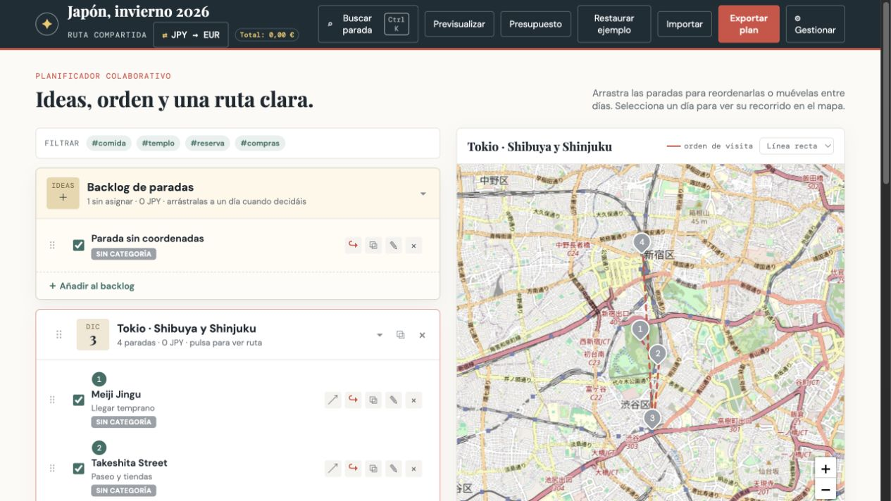

# Trip Planner

> A lightweight, map-based itinerary planner for turning a list of ideas into a clear day-by-day route.

Trip Planner is a responsive, browser-based travel organizer built with vanilla JavaScript. Add places to a backlog, arrange them into days with drag and drop, and visualize each day's route on an interactive map. Plans are saved locally and can be exported as JSON to back them up or share them with another traveler.

The interface is currently available in Spanish.



## Features

- **Day-by-day itineraries** — create, rename, reorder, duplicate, collapse, and delete travel days.
- **Flexible backlog** — collect ideas before deciding where they belong.
- **Custom drag and drop** — reorder stops or move them between days on desktop and touch devices.
- **Interactive maps** — display numbered stops and switch between straight lines and street-based routes.
- **Travel profiles** — calculate routes for walking, cycling, or driving.
- **Place search** — find addresses through OpenStreetMap and preview their location before saving.
- **Stop details** — keep notes, tags, categories, opening hours, costs, and map visibility preferences for every place.
- **Schedule overview** — compare opening-hour ranges and spot possible overlaps within a day.
- **Tags and categories** — organize stops, filter the itinerary, customize colors, and control which categories connect to the route.
- **Quick search** — jump to any saved stop with `Ctrl/Cmd + K`.
- **Trip budget** — track costs by day and see totals in both local and foreign currencies.
- **Currency conversion** — retrieve current exchange rates for a selection of common currencies.
- **Trip notes** — save general information using lightweight Markdown formatting.
- **Preview mode** — switch to a cleaner, read-only presentation of the itinerary.
- **Import and export** — save the complete plan as JSON and restore it later.
- **Local persistence** — changes are automatically stored in the browser with `localStorage`.
- **Responsive design** — designed for both desktop and mobile use.

## Getting Started

There is no build step and no package installation. You only need a modern browser and a small local web server.

```bash
git clone <your-repository-url>
cd trip-planner
python3 -m http.server 8000
```

Then open [http://localhost:8000](http://localhost:8000) in your browser.

> Opening `index.html` directly with a `file://` URL is not supported because the application uses native ES modules.

## How to Use

1. Change the trip name at the top of the page.
2. Add places to the backlog or directly to a travel day.
3. Select an address suggestion to attach coordinates to a stop.
4. Drag stops into the order in which you want to visit them.
5. Select a day to display its route on the map.
6. Add categories, tags, schedules, notes, and costs as needed.
7. Export the plan as JSON when you want a backup or wish to share it.

The app starts with a sample itinerary, which can be restored at any time from the top navigation.

## Project Structure

```text
trip-planner/
├── index.html          # Application shell and dialogs
├── styles.css          # Complete visual design and responsive layout
└── js/
    ├── main.js         # Application entry point
    ├── store.js        # Shared state and local persistence
    ├── render.js       # Itinerary rendering and mutations
    ├── dialogs.js      # Place, tag, and category dialogs
    ├── dnd.js          # Pointer-based drag and drop
    ├── map.js          # Leaflet maps and route rendering
    ├── actions.js      # Header actions and import/export
    ├── budget.js       # Budget breakdown
    ├── currency.js     # Currency formatting and exchange rates
    ├── notes.js        # Trip notes and Markdown preview
    ├── spot-search.js  # In-plan quick search
    ├── images.js       # Wikipedia image lookup
    └── ...             # Constants, DOM helpers, and notifications
```

The project uses native ES modules and intentionally has no framework, bundler, package manager, or build pipeline.

## External Services

Some functionality requires an internet connection:

- [Leaflet](https://leafletjs.com/) for interactive maps
- [OpenStreetMap](https://www.openstreetmap.org/) for map tiles
- [Nominatim](https://nominatim.org/) for place search and geocoding
- [OSRM](https://project-osrm.org/) public routing servers for street-based routes
- [Frankfurter](https://frankfurter.dev/) for exchange rates
- [Wikipedia](https://www.wikipedia.org/) for place thumbnails
- [Google Fonts](https://fonts.google.com/) for typography

These are public third-party services. Their availability, usage policies, and rate limits are outside this project's control. Straight-line route visualization and previously saved itinerary data remain available when routing or geocoding services cannot be reached.

## Data and Privacy

The itinerary is stored in your browser under the `trip-planner` `localStorage` key. There is no project-owned backend or account system. Place searches, routes, exchange-rate requests, map tiles, and image lookups are sent directly from the browser to their respective third-party services.

Clearing site data will remove the locally saved plan, so export important itineraries as JSON before clearing browser storage or moving to another device.

## Browser Support

Trip Planner targets current versions of Chrome, Edge, Firefox, and Safari. It relies on modern browser features such as ES modules, `dialog`, `structuredClone`, pointer events, and `localStorage`.

## Development

Edit the HTML, CSS, or JavaScript files and refresh the browser. Since there is no automated test suite, changes should be checked manually by serving the project and exercising the relevant desktop and mobile flows.

Contributions are welcome. When changing the UI, keep user-facing copy in Spanish, escape user-provided values before inserting them into HTML, and preserve the central render cycle used throughout the application.
